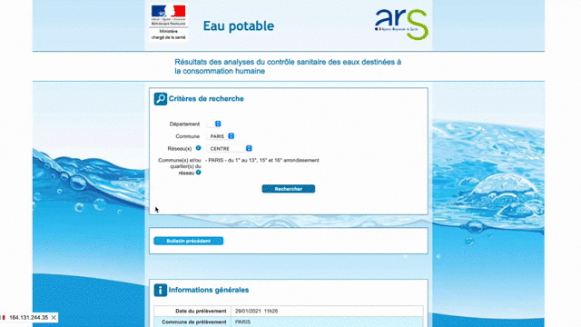

# Orobnat-API-PHP
This is an unofficial API to get data from https://orobnat.sante.gouv.fr ( orobnat ), which collects all water quality data from France. 
Below description in French, but PR and Issues are welcome in all languages. 

## Description 
Le site https://orobnat.sante.gouv.fr fourni les résultats du contrôle sanitaire de l'eau du robinet: prélèvements et résultats des analyses réalisés dans le cadre du contrôle sanitaire réglementaire des eaux fournies par un réseau de distribution. Néanmoins les données sont pas exploitables via d'autres systèmes (monitoring, domotique, métier, etc.) car aucune API n'est disponible officiellement. 

## Récupérer les paramètres
Depuis votre navigateur préféré, vous pourrez récupérer les paramètres. Ci-dessous un exemple sous Firefox ( 
 ) : 

## Usage
 
    $orobnat = new orobnat($idRegion , $departement, $communeDepartement, $reseau);
    print_r( $orobnat->getData() );

Dans le dossier `Examples`, 2 exemples de flux JSON, dont un avec une fonctionnalité de cache. 

### Demo
Dans un but de démonstration, le fichier d'exemple JSON_with_cache.php est accessible ici : https://orobnat-api.appsenso.eu/json_with_cache.php avec les 4 paramètres en GET. 

Exemple :  https://orobnat-api.appsenso.eu/json_with_cache.php?idRegion=76&departement=012&communeDepartement=12021&reseau=012000747_012

# Bonus
- Toutes les données compilées de France et leurs historiques sont en Open Data : https://www.data.gouv.fr/fr/datasets/resultats-du-controle-sanitaire-de-leau-du-robinet/ 
- Orobnat API en Python : https://github.com/Thomas-Houtrique/FrenchWater
